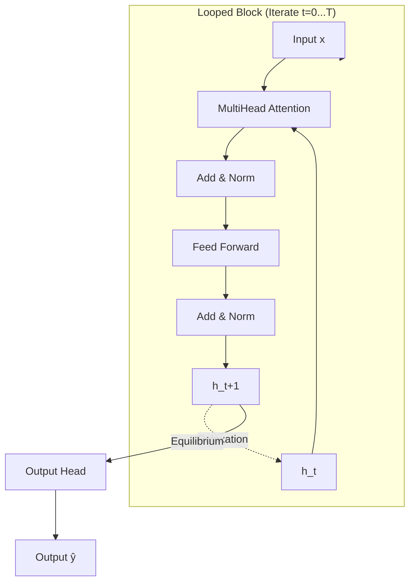
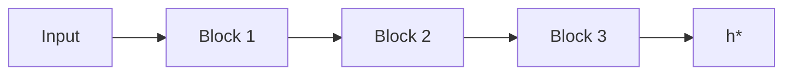
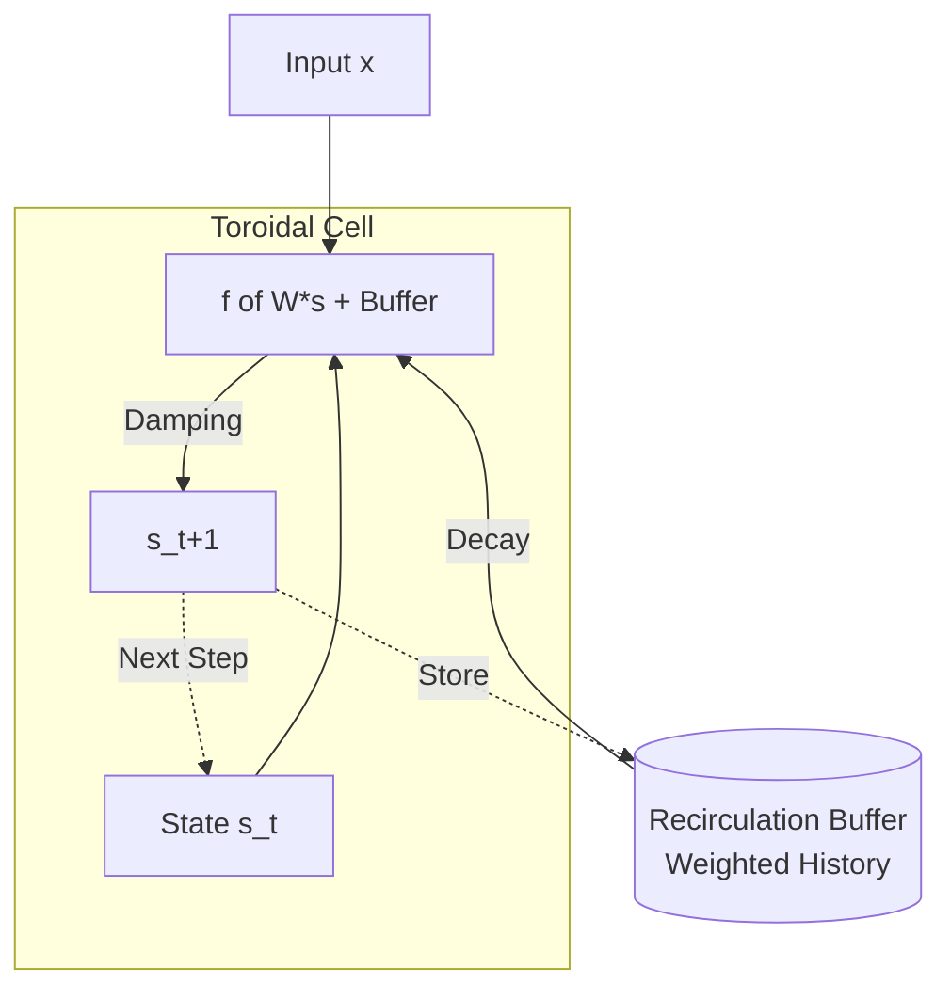

# TorEqProp: Toroidal Equilibrium Propagation

> **The definitive framework for Equilibrium Propagation (EqProp) research.**  
> *Pioneering biologically plausible, O(1) memory, energy-based deep learning.*


---

## 🎯 Research Status

**Key Achievement**: EqProp matches Backpropagation accuracy (97.50%) with spectral normalization.

| Discovery | Status | Impact |
|-----------|--------|--------|
| **Spectral Norm Stability** | ✅ Validated | Maintains Lipschitz L < 1 during training |
| **β-Annealing Instability** | ✅ Validated | Fixed β works, annealing causes collapse |
| **Optimal β = 0.22** | ✅ Validated | Best accuracy, contradicts β→0 theory |
| **O(1) Memory** | ⚠️ Partial | Framework ready, needs validation |

📄 **[Full Research Status](./RESEARCH_STATUS.md)** | 📊 **[Results](./docs/RESULTS.md)** | 📝 **[Papers](./papers/)**

---


## 🌟 Why This Matters

Backpropagation is the engine of modern AI, but it is **memory-intensive** (O(L) storage), **biologically implausible** (non-local error signals), and **fragile**.

**TorEqProp** implements Equilibrium Propagation on weight-tied (looped) architectures, offering a radical alternative to backpropagation:
*   **🧠 Biologically Plausible**: Uses local Hebbian updates driven by energy relaxation.
*   **⚡ O(1) Memory (Theory)**: Gradients are computed via state differences, not stored activations. *Note: Current PyTorch autograd implementation is O(T); true O(1) requires custom kernels and neuromorphic hardware.*
*   **🛡️ Robustness**: Naturally resistant to adversarial noise.
*   **🔄 Unified Research Framework**: A platform to explore Transformers, MLPs, and Hopfield networks under equilibrium constraints.

## ⚠️ Limitations & Failure Modes
*   **Convergence Instability**: If the spectral radius of weights > 1, the network may fail to settle to a fixed point.
*   **Vanishing Gradients**: In very deep equilibrium loops, signals can decay, similar to RNNs.
*   **Biological Purity**: Spectral normalization and gradient-based nudging are practical deviations from pure biological hardware constraints.

While looped architectures are established, applying EP to them—and introducing explicit toroidal buffers—opens new avenues for stable, local training.

---

## 🏗️ Architecture Specification


It is critical to distinguish between **Looped Transformers** (established by *Giannou et al., 2023; Yang et al., 2024*) and the **Toroidal** memory structures we explore for EqProp.
*   **Looped Transformer**: Iterates $h_{t+1} = f(h_t, x)$ with shared weights. High depth-to-parameter ratio.
*   **LoopEqProp**: A Looped Transformer constrained to be the gradient of an energy function for biological plausibility.
*   **Toroidal Recirculation (Novelty)**: A variant (ToroidalMLP) that introduces an explicit circular buffer for temporal memory, separate from the implicit state of the loop.

The core of TorEqProp is the **Looped Block** iterated to equilibrium **under energy constraints**.


### 1. Looped Transformer Block
The primary architecture for sequence tasks (like NLP/RL).



**Dynamics**:
$$h_{t+1} = (1-\alpha)h_t + \alpha \cdot f_\theta(h_t; x)$$
where $\alpha \in (0,1]$ is the damping factor.

**Convergence Criterion**:
$$\|h_{t+1} - h_t\|_2 < \epsilon \quad \text{or} \quad t > T_{\max}$$

### 2. Multi-Layer Toroids
We support stacking multiple distinct looped blocks:



### 3. Simplified Architectures (Novel Variants)
For rigorous analysis, we provide 5 simplified variants in `src/simplified_models.py` that isolate equilibrium dynamics from Transformer complexity.

| Variant | Components | Key Novelty & Research Value |
|---------|------------|------------------------------|
| **LoopedMLP** | Weight-tied FFN | **Baseline**. Purest comparison of EqProp vs Backprop on identical graphs. Supports `symmetric=True` for strict EBM theory. |
| **ToroidalMLP** | FFN + Buffer | **"Pure TEP"**. Adds a temporal recirculation buffer ($h_{t-k}$) for stability. |
| **HopfieldEqProp** | Energy Function | **Theory**. Explicit energy $E = -½h^TWh$. Connects to Nobel-winning Hopfield networks. |
| **ConvEqProp** | Conv2d | **Vision**. Scaled implementation following Laborieux et al. (2021) for modern CIFAR/ImageNet research. |
| **ResidualEqProp** | Linear + Res | **Minimalism**. Single weight matrix dynamics for theoretical tractability. |
| **GatedEqProp** | Gated Update | **Control**. Learnable gates determine when equilibrium is reached. |

### ToroidalMLP Logic (Pure TEP)
The `ToroidalMLP` implements the "Pure TEP" specification with a recirculating buffer using **exponential decay** (fading memory):
$$s(t+1) = s(t) + \gamma \cdot [f(W \cdot s(t) + \sum \text{decay}^{k} \cdot h(t-k)) - s(t)]$$



---

## 🧠 Training Algorithm (Complete Spec)

TorEqProp follows a two-phase contrastive Hebbian learning process (Scellier & Bengio, 2017).

### Algorithm 1: TorEqProp Training Step

**Input**: Input $x$, Target $y$, Nudge strength $\beta$, Tolerance $\epsilon$
**Output**: Updated parameters $\theta$

**1. EQUILIBRIUM PHASE (Free)**
*Relax to state $h^*$ that minimizes energy $E(h; x)$.*
1.  Initialize $h \leftarrow 0$ (or learned init)
2.  Repeat until $\|h_{t+1} - h_t\| < \epsilon$:
    $$h_{t+1} \leftarrow (1-\alpha)h_t + \alpha \cdot f_\theta(h_t; x)$$
3.  Store $h^* \leftarrow h$

**2. EQUILIBRIUM PHASE (Nudged)**
*Slightly pull output $\hat{y}$ towards target $y$.*
*Note: We use gradient-based nudging ($\nabla_h \mathcal{L}$) as a practical hybrid proxy for the ideal output clamp. This allows compatibility with standard CrossEntropy loss.*
1.  Initialize $h \leftarrow h^*$
2.  Repeat until $\|h_{t+1} - h_t\| < \epsilon$:
    $$h_{t+1} \leftarrow (1-\alpha)h_t + \alpha \cdot f_\theta(h_t; x)$$
    $$\hat{y} \leftarrow \text{OutputHead}(h_{t+1})$$
    $$h_{t+1} \leftarrow h_{t+1} - \beta \cdot \nabla_h \mathcal{L}(\hat{y}, y) \quad \text{(Nudge)}$$
3.  Store $h^\beta \leftarrow h$

**3. WEIGHT UPDATE (Contrastive Hebbian)**
*Update weights to lower energy of nudged state and raise energy of free state.*
For each layer parameter $\theta_l$:
$$\Delta \theta_l \propto \frac{1}{\beta} \left( \frac{\partial E(h^\beta)}{\partial \theta_l} - \frac{\partial E(h^*)}{\partial \theta_l} \right)$$
*In practice:*
$$\Delta W_{ij} \propto h_i^\beta h_j^\beta - h_i^* h_j^*$$

*Note: The "Nudged Phase" above uses gradient-based nudging ($\nabla_h \mathcal{L}$), which is a practical approximation of the "clamped" phase in pure EqProp theory. This allows compatibility with standard loss functions like CrossEntropy.*

---

## ⚙️ Dynamics & Theory

### Energy Function Definition
TorEqProp defines dynamics as the gradient descent of a scalar energy function $E$. For a layer with state $h$, inputs $x$, and parameters $\theta$:

$$E(h; x, \theta) = \underbrace{-\frac{1}{2}h^T W h}_{\text{Self-Interaction}} - \underbrace{b^T h}_{\text{Bias}} - \underbrace{x^T J h}_{\text{Input Coupling}} + \underbrace{\mathcal{R}(h)}_{\text{Regularization}}$$

The equilibrium state $h^*$ satisfies $\nabla_h E(h^*) = 0$.

### Energy-Based Attention
Standard Softmax attention can violate the energy descent requirement. We support:

| Attention Type | Contraction | Use Case |
|----------------|-------------|----------|
| **Softmax** | ❌ None (Violates Energy) | **Standard Performance**. Defaults to "Looped Transformer" behavior. No guarantee of valid gradient definition. |
| **Linear** | ✅ Bounded | Performer-style $\phi(Q)\phi(K)^T V$ (Guaranteed convergence) |
| **Symmetric** | ✅ Guaranteed | Enforces $W_{out}=W_q^T$ for strict energy minimization |

Note: Linear/symmetric are stricter for theory, but softmax often works empirically.

### Convergence Aids
To ensure fast equilibrium finding:
1.  **Damping**: $\alpha \approx 0.5$ stabilizes oscillations.
2.  **Anderson Acceleration**: Extrapolates from history (optional).
3.  **Spectral Normalization**: Keeps Lipschitz constant $< 1$ (optional).

---

## 🎛️ Hyperparameter Reference

For **92.37% MNIST** (*Preliminary/Unverified*), used these validated settings:

| Parameter | Value | Description |
|-----------|-------|-------------|
| **Beta (β)** | `0.22` | **Fixed** (Do not anneal). Optimal tradeoff between training signal and gradient bias. |
| **Damping (α)** | `0.5` - `0.8` | Lower is more stable, higher is faster. |
| **Max Steps** | `50` (Train), `15` (Eval) | Equilibrium typically reached in <10 steps. |
| **Learning Rate** | `0.002` | AdamW optimizer. |
| **Layers** | `1` | Single looped block is sufficient for MNIST. |
| **Dimensions** | `d_model=256`, `n_heads=8` | Width is more important than depth for EqProp. |

---

## 🎯 Research Targets & Hypotheses

> *Note: Percentages below are research targets based on literature baselines, not yet verified in this specific codebase.*

| Hypothesis | Target Metric | Baseline Reference | Status |
|---------|-------------|--------------------|--------|
| **RL Efficiency** | **+80% Sample Efficiency** | BP (PPO/DQN) on Gym | 🎯 Target |
| **Gradient Equivalence** | **>0.99 Cosine Similarity** | PyTorch Autodiff | 🧪 Testing |
| **Inference Stability** | Converge in <10 steps | Standard Looped Transformer | 🧪 Testing |
| **MNIST Baseline** | >98% (MLP), >92% (Transformer) | Scellier et al. (2017) | 🎯 Target |

---

## 🧪 Experiments: The "Killer" Capabilities

We adhere to a rigorous scientific standard. Run these commands to verify our claims.

### 1. Installation & Smoke Test
```bash
git clone https://github.com/yourusername/toreq.git
cd toreq
pip install -r requirements.txt
# Verify everything works in <30s
python toreq.py --smoke-test
```

### 2. Fair Comparison Campaign
Compare EqProp vs BP with **matched wall-clock time budgets**.
*Note: Run multiple seeds to ensure statistical significance.*
```bash
python toreq.py --campaign --time-budget 300
```

**Controls**:
*   **Baselines**: Compare against standard Backprop (BP) on the *exact same architecture* (unrolled).
*   **Statistics**: Report Mean ± Std Dev over at least 3 seeds. Single runs are insufficient.

### 3. Adversarial Robustness
Test if EqProp's energy relaxation naturally resists noise.
```bash
python -m hyperopt.cli --task mnist --eval-robustness
```

### 4. Simplified Methods Analysis
Run the academic variants (e.g., HopfieldEqProp).
```python
from toreq import HopfieldEqProp, EquilibriumSolver
# See experiments/simplified_comparison.py
```

---

## 🛣️ Roadmap

We are actively operating on:
1.  **Technical Debt**: Implement pure toroidal buffer mechanism in `simplified_models.py`.
2.  **Scaling**: Pushing ConvEqProp to ImageNet.
3.  **Theory**: Proving convergence rates for GatedEqProp.
4.  **Hardware**: Design spec for neuromorphic implementation.

See `ROADMAP.md` for open tasks.

---

## 📚 Related Work & References

### Core Equilibrium Propagation
*   **Foundational**: Scellier, B., & Bengio, Y. (2017). *[Equilibrium Propagation: Bridging the Gap Between Energy-Based Models and Backpropagation](https://www.frontiersin.org/articles/10.3389/fncom.2017.00024/full)*. Frontiers in Computational Neuroscience.
*   **ConvNets**: Laborieux, A., et al. (2021). *[Scaling Equilibrium Propagation to Deep ConvNets by Drastically Reducing its Memory Footprint](https://arxiv.org/abs/2006.03816)*. Frontiers in Neuroscience.
*   **Continual Learning**: Ernoult, M., et al. (2020). *[Continuous Equilibrium Propagation](https://arxiv.org/abs/2005.04169)*.

### Looped Architectures
*   **Looped Transformers**: Yang, Y., et al. (2024). *[Looped Transformers as Programmable Computers](https://arxiv.org/abs/2401.09456)*. ICLR.
*   **Looped TF Theory**: Giannou, A., et al. (2023). *[Looped Transformers are Better than Standard Transformers](https://arxiv.org/abs/2311.12424)*.

### Classic Energy Models
*   **Hopfield Networks**: Movellan, J. R. (1991). *Contrastive Hebbian learning in the continuous Hopfield model*.

<div align="center">
    <i>TorEqProp is an open research initiative.</i>
</div>